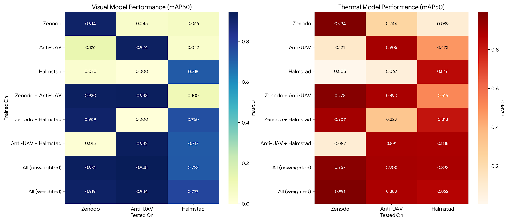

# Offline ML Setup

This offline_ml folder serves as an offline machine learning section of the repo for the multimodal drone detection capstone project. The steps to install a Conda environment below ensure all users/contributors have the same package versions and dependencies.

## 1. Prerequisites

Before setting up the environment, make sure you have one of the following installed:
- [Miniconda](https://docs.conda.io/en/latest/miniconda.html) (recommended)
- [Anaconda](https://www.anaconda.com/download)

Check installation with the command below:
```bash
conda --version
```
If this command returns with a version number, your conda is correctly installed.

## 2. Create Environment

Follow the commands below to create a Conda environment. Make sure you are currently in the offline_ml directory.
```bash
conda env create -f environment.yml
conda activate ml_env
```
You should see "(ml_env)" to the left of your username. If this appears, you're Conda environment will be setup and you will now be able to run code within this folder. In addition, check the bottom right of your VS code to see the python version you are running. It should be "ml_env (3.12.3)". If it is something else, make sure your environment is activated and make sure the Python venv called multimodal-drone-detection is not active. This is a venv that is used for backend and other parts of the code base. The command below will remove the venv from your terminal, but you still need to ensure that the correct environment is being used in the bottom left.

```bash
deactivate
```

## 3. Additional Information

This command allows you to update the environment.yml file if new packages are installed or removed:
```bash
conda env export > environment.yml
```

## 4. Linting

For any linting needs, ruff and uv are present in the conda environment to help format files correctly and determine/fix linting errors. The following commands can be run to help with linting.

For changing the linting format of the full file (DO THIS FIRST).
```bash
uv run ruff format <file_path>
```

For basic checking and fixing of linting errors.
```bash
ruff check --fix
```


# Datasets

The following datasets are used for this project. All datasets should be stored in the `datasets/` directory at the same level with the directory names listed below.

## 1. Zenodo Datasets

- [Zenodo Visual Drone Detection Dataset - Non-Augmented](https://zenodo.org/records/15632958):
  - `zenodo_visual_no_augmentation`
- [Zenodo Thermal Drone Detection Dataset - Non-Augmented](https://zenodo.org/records/15633051): 
  - `zenodo_thermal_no_augmentation`

## 2. Anti-UAV Dataset

- [Anti-UAV](https://github.com/ZhaoJ9014/Anti-UAV) - Paired RGB and thermal videos of drones in various environments and conditions. Scroll down on the Anti-UAV README until you can click on a Google Drive link for the "Anti-UAV300" dataset. Download and place the raw dataset at `datasets/anti_uav`. Run the preprocessing script (see Preprocessing section) to generate the processed datasets:
  - `anti_uav_visual_no_augmentation`
  - `anti_uav_thermal_no_augmentation`

## 3. Halmstad Dataset

- [Halmstad Multi Sensor](https://github.com/DroneDetectionThesis/Drone-detection-dataset/tree/master/Data) - RGB and thermal videos with a mix of drones, planes, helicopters, and birds. Download and place the raw dataset at `datasets/halmstad_multi_sensor`. See the preprocessing section for more information on how to preprocess this dataset:
  - `halmstad_visual_no_augmentation`
  - `halmstad_thermal_no_augmentation`


# Initial Data Analysis

The `data_exploration` Jupyter Notebook has initial data analysis on each dataset and can be reviewed in VS Code or through the jupyter notebook bash command. Make sure you are in the ml_env conda environment to use the notebook effectively, in addition to having the datasets downloaded and preprocessed. Example outputs are preserved in the notebook.


# Preprocessing

All preprocessing scripts should be run from the `offline_ml/` directory.

## 1. Zenodo Thermal Dataset

The thermal dataset was missing labels (drone was present, label was not) on about 18% of its images. These missing labels were present across all splits, and them along with the images were removed from the dataset by running:

```bash
python src/preprocessing_zenodo.py
```

This script moves all images with empty label files to a temporary directory and then deletes it, leaving only fully labeled images in the dataset.

## 2. Anti-UAV Dataset

The Anti-UAV dataset consists of paired thermal and visual videos with JSON annotations. The preprocessing script extracts frames from each video, converts bounding box annotations from pixel coordinates to YOLO format, and outputs a thermal and visual dataset matching the Zenodo dataset directory structure.

Key preprocessing decisions:
- Frames are sampled at every 10th frame to avoid duplicate frames while preserving drone motion
- Negative frames (exist=0 in JSON) are sampled at the same rate as positive frames to avoid over-representing plain sky backgrounds
- Thermal frames are outputted to `anti_uav_thermal_no_augmentation`, visual to `anti_uav_visual_no_augmentation`
- The Anti-UAV `val` split is renamed to `valid` to match Zenodo structure

Note: Anti-UAV visual frames contain a reticle and chinese text watermark that cannot be removed. This is consistent across all visual frames, and the reticle doesn't move in relation to the drone, so it isn't expected to significantly impact training.

Run the preprocessing script:
```bash
python src/preprocessing_anti_uav.py
```

## 3. Halmstad Multi-Sensor Dataset

This dataset features RGB and thermal videos of drones, planes, helicopters, and birds. There is plently of data in this dataset, and the negative samples are crucial for the model, but the labels were encoded in `.mat` files. These files are read directly in Python using the `mcos-decoder` library, requiring no MATLAB installation.

Key preprocessing decisions:
- Splits are assigned by unique video sequence rather than individual frames. This will ensure that if a specific frame of a drone, bird, airplane, or helicopter appears in one split a similar frame won't appear in the others.
- All frames containing non-drone objects (birds, planes, helicopters) are assigned empty YOLO label files so the model focuses solely on detecting drones, using these as hard negative examples.
- Frames are sampled at every 10th frame to avoid duplicate frames while preserving drone motion

These commands will clone the repository and remove git tracking from it. Make sure to rename the folder to halmstad_multi_sensor for the other scripts.

```bash
cd offline_ml/datasets
git clone https://github.com/DroneDetectionThesis/Drone-detection-dataset.git
cd Drone_detection-dataset
rm -rf .git
```

Then, run the preprocessing script:
```bash
python src/preprocessing_halmstad.py
```


# Initial Model Training

Initial model training and evaluation were conducted first on the zenodo datasets without preprocessing in the train.ipynb notebook, and was ran in Google Colab for free access to their T4 GPU. Model outputs are featured in this notebook as an example, but to replicate this output, you can download the notebook and follow instructions there.

In order to keep all code in the repository and limit the use of external tools, the train.ipynb notebook was converted into train.py, and training is now conducted on the VT ARC Cluster. See the ARC Cluster Setup section for a walkthrough on getting this resource set up. To run train.py locally to test it works, you can run this bash command below, however, keep in mind that CPU training would be too time intensive to train each of these models fully. Make sure this command is ran from the `offline_ml/` directory.

```bash
python src/train.py --data datasets --epochs 1
```


# ARC Cluster Setup

To be able to run python scripts connected to the rest of the repository but ran on GPUs, we utilized the GPU power of the Virginia Tech Advanced Research and Computing (ARC) Cluster. The following instructions note how to get started, however, it should be noted that to get the full use out of the VT ARC Cluster an instructor must create an account to give you access. The following setup is based on our instructor giving us Instructional Allocation to the ARC Cluster.

## 1. Setting up VPN

To be able to access the ARC cluster when you are at home or not on eduroam wifi, you must use a VPN. To access the VPN, please follow the instructions for your specific configuration using this [link](https://www.nis.vt.edu/ServicePortfolio/Network/RemoteAccess-VPN.html).

## 2. Setting up SSH Connection

Once the instructor has given you access, the first step is to ssh into one of the computing resources ARC provides. The easiest way to do this is through VS Code. First, ensure you have the Remote - SSH extension installed and locate the icon on the extension bar on the left titled "Remote Explorer". Click on this and then hover over the SSH dropdown and click the "+" icon on the right. The ssh command entered should look something like this below:

```bash
ssh <your_PID>@tinkercliffs2.arc.vt.edu
```

There are multiple different resources such as tinkercliffs1 or falcon1, but tinkercliffs had the GPU resources that would work the best for our project. The SSH config file selection should already be created for you and be in your Users directory, so select this one. If this works, you will be asked to enter your Virginia Tech password and then will have to authenticate using DUO mobile on your phone or other device.

This [tutorial](https://video.vt.edu/media/Connect+to+ARC+Systems+with+VSCode/1_5q3mxyi0) provides more in-depth instructions.

## 3. Git Clone Repository

Next, use git to clone this repository onto your ARC account:

```bash
git clone https://github.com/azizs1/multimodal-drone-detection.git
```

This should provide all of the same code that it provides on your local machine, however, now you have the option to run the code on better computing resources.

## 4. Setting up Environment

To set up an environment on the ARC cluster, you have to set it up on the compute node that you want to run the training code on. The following commands allow for quick environment setup. This environment only needs to be created once in the partition that you will use, and then will be able to be activated during other training jobs on the same partition.

First, get your account id you need to run jobs on the ARC cluster, this id will be useful when running jobs later. There will potentially be multiple account ids that show up, including "personal". Use the one that doesn't say "personal", mine is "lnn".

```bash
sacctmgr show associations user=$USER format=account
```

Then, start an interactive job on the compute node that training will take place on:

```bash
interact --partition=h200_normal_q --nodes=1 --ntasks-per-node=4 --gres=gpu:1 --account=<account_id>
```

If you see text like similar to the text below, then it mean you are successfully on a compute node and can continue:

 *--- Warning:*
     *Your session consumes resources (CPUs, memory, and GPUs) while it remains open.*
     *Close your session whenever you finish your work.*
     *Other users cannot use the resources allocated to your job until you close your session.*
     *Consider the use of batch jobs to optimize resources allocation.*
*srun: job 4843586 queued and waiting for resources*
*srun: job 4843586 has been allocated resources*
*[eymauger26@tc-dgx008 multimodal-drone-detection]$*

Next, load Miniforge onto the compute node:

```bash
module load Miniforge3
```

Make sure you are in the multimodal-drone-detection directory (root directory of the repo) and then run the command below:

```bash
conda env create -p ~/envs/ml_env -f offline_ml/environment.yml
```

It will take quite a while to load the environment onto the node. Once it is good to go, activate it:

```bash
source activate /home/<PID>/envs/ml_env
python offline_ml/src/train.py --data offline_ml/datasets --epochs 1
```

The compute node may be slow, so as long as that second command runs the environment should be good to go. Exit out of the interactive node:

```bash
exit
```

## 5. Migrate Data to ARC Cluster

NOTE: If you are already a member of the team, skip this step, the datasets are already in our shared projects/muataz/datasets folder.

For documentation purposes, this is how I got the datasets into our shared folder on the ARC cluster. These datasets are stored as zip files and during training they are unzipped locally for faster training speeds. These datasets were stored into a project folder provided by our instructor. To get the datasets onto ARC, preprocess them locally first from the `datasets/` dir and then upload the processed zip files to the projects folder:

```bash
zip -r zenodo_thermal_no_augmentation.zip zenodo_thermal_no_augmentation
zip -r zenodo_visual_no_augmentation.zip zenodo_visual_no_augmentation
zip -r anti_uav_thermal_no_augmentation.zip anti_uav_thermal_no_augmentation
zip -r anti_uav_visual_no_augmentation.zip anti_uav_visual_no_augmentation
zip -r halmstad_thermal_no_augmentation.zip halmstad_thermal_no_augmentation
zip -r halmstad_visual_no_augmentation.zip halmstad_visual_no_augmentation
```

## 6. Creating and Submitting a SLURM Job

Now, to run code on the ARC cluster, you have to create jobs using a bash script. The following section outlines how to set this up.

First, create a scratch directory to store your training outputs:

```bash
mkdir -p /scratch/<PID>
```

Next, you have to update the script to add in your own credentials so that it works. The SLURM job script is located at `offline_ml/src/train.sh`. Before submitting, make sure to update the following in the script:
- `--account=<account_id>` - Your account ID from step 4
- `--output` and `--error` paths - Replace `eymauger26` with your PID
- `source activate` path - Replace `eymauger26` with your PID
- `/projects/muataz/datasets` - Update if the project folder name changes

Once you are ready, make sure you are located in the root directory of the repo and run this bash command to submit the job:

```bash
sbatch offline_ml/src/train.sh
```

To monitor that the job is running, run this command below:

```bash
squeue -u $USER
```

The status column will show the status of the job. These are the common values and what they mean:
- `PD` - job is pending/waiting for resources
- `R` - job is running
- `CG` - job is completing

To cancel a job that you didn't mean to queue, you can run this command below.

```bash
scancel <jobid>
```

Training logs are saved to `/scratch/<PID>/logs` as `.out` and `.err` files. The `.out` file contains the training progress output and the `.err` file contains any errors. To check the output logs, run this command below:

```bash
cat /scratch/<PID>/logs/mdd_offline_ml_training.<jobid>.out
```

To check the error logs, run this command below:
```bash
cat /scratch/<PID>/logs/mdd_offline_ml_training.<jobid>.err
```

If you want to watch the output in real time while the job is running:
```bash
tail -f /scratch/<PID>/logs/mdd_offline_ml_training.<jobid>.out
```

Once the job finishes, results will be saved to `/scratch/<PID>/runs/`. To find your trained model weights:
```bash
find /scratch/<PID>/runs -name "best.pt"
```

The slurm script automatically saves these weights into the weights directory and can then be commited to git or removed.


# Model Robustness

To improve model robustness beyond the initial Zenodo baselines, additional datasets have been integrated to address key gaps identified during data analysis:

Key Gaps in Zenodo Data:
- Limited Drone Diversity
- No Hard Negatives
- Limited Range
- No Nighttime Data

## Datasets Added

- [Anti-UAV](https://github.com/ZhaoJ9014/Anti-UAV) - 296,901 frames of paired RGB and thermal drone footage across 320 videos. Provides small bounding boxes (long range drones), nighttime footage, and a few examples of images without drones present (negatives).
- [Halmstad Multi-Sensor](https://github.com/DroneDetectionThesis/Drone-detection-dataset/tree/master/Data) - Specifically integrated to provide a robust negative sample set. It includes annotated frames of birds, airplanes, and helicopters, which are critical for reducing false positives.

## Updated Dataset Summary

| Dataset | Visual Images | Thermal Images | Notes |
|---------|--------------|----------------|-------|
| Zenodo | 2,145 | 1,760 | Close range, suburban/campus/foiliage backgrounds, no negatives |
| Anti-UAV | 29,727 | 29,727 | Long range, nighttime, ~5.6% visual / ~1.2% thermal negatives |
| Halmstad | 8,928 | 11,570 | ~60% negatives (birds/planes/helicopters), mostly clear sky backgrounds |
| **Total** | **40,800** | **43,057** | |

## Planned Datasets

The following datasets could be added with future work and prior approval, but are only sets with RGB data:
- [WOSDETC Drone-vs-Bird](https://github.com/wosdetc/challenge) - This dataset includes ground camera videos with both drone and bird annotations. To get access to this data, send an email request to wosdetc@googlegroups.com. You will then be asked to sign and return a data usage agreement.
- [LRDDv2](research.coe.drexel.edu/ece/imaple/lrddv2) - This dataset includes videos of drones from up to 1km away, providing more training data for the model to train on drones from further away. To get access to this data, fill out the google form on their website.
- [FBD-SV-2024](https://github.com/Ziwei89/FBD-SV-2024_github/blob/master/README.md) - This dataset specifically includes labeled birds in images with heavy noise. No prior approval is needed for this dataset.

## Training Strategy

Training is structured in two phases. First, each dataset is trained independently to establish baselines and understand what each dataset contributes individually. Second, datasets are combined in various configurations to improve generalization across deployment scenarios. All training is configured in `src/train.py` for individual baselines and `src/train_combined.py` for combined experiments.

### Individual Baselines

Each dataset is trained independently using `src/train.py`:
- `zenodo_visual_baseline`
- `zenodo_thermal_baseline`
- `anti_uav_visual_baseline`
- `anti_uav_thermal_baseline`
- `halmstad_visual_baseline`
- `halmstad_thermal_baseline`

### Combined Dataset Training

Based on individual baseline results showing poor cross-dataset generalization, datasets are combined in various configurations called *experiments* using `src/train_combined.py`. Both unweighted and weighted experiments are tested, where weighting oversamples smaller datasets to prevent larger datasets from dominating training:

Visual Experiments:
- `visual_zenodo_antiuav`
- `visual_zenodo_halmstad`
- `visual_antiuav_halmstad`
- `visual_all`
- `visual_all_weighted` (zenodo oversampled 14x and halmstad 3x relative to anti_uav)

Thermal Experiments:
- `thermal_zenodo_antiuav`
- `thermal_zenodo_halmstad`
- `thermal_antiuav_halmstad`
- `thermal_all`
- `thermal_all_weighted` — (zenodo oversampled 17x and halmstad 3x relative to anti_uav)

## Results

### Individual Baseline Results

Each model is evaluated on its own test set (diagonal) and on the other datasets' test sets to measure generalization. Evaluation is run using `src/cross_evaluation.py`.

#### Individual Results for Visual Models/Datasets

| Model Trained On | Zenodo mAP50 | Zenodo Recall | Zenodo Precision | Anti-UAV mAP50 | Anti-UAV Recall | Anti-UAV Precision | Halmstad mAP50 | Halmstad Recall | Halmstad Precision |
|-----------------|-------------|---------------|-----------------|----------------|-----------------|-------------------|----------------|-----------------|-------------------|
| Zenodo | **0.914** | **0.889** | **0.891** | 0.045 | 0.070 | 0.175 | 0.066 | 0.410 | 0.105 |
| Anti-UAV | 0.126 | 0.162 | 0.359 | **0.924** | **0.878** | **0.969** | 0.042 | 0.137 | 0.159 |
| Halmstad | 0.030 | 0.051 | 0.367 | 0.000 | 0.001 | 0.000 | **0.718** | **0.754** | **0.740** |

#### Individual Results for Thermal Models/Datasets

| Model Trained On | Zenodo mAP50 | Zenodo Recall | Zenodo Precision | Anti-UAV mAP50 | Anti-UAV Recall | Anti-UAV Precision | Halmstad mAP50 | Halmstad Recall | Halmstad Precision |
|-----------------|-------------|---------------|-----------------|----------------|-----------------|-------------------|----------------|-----------------|-------------------|
| Zenodo | **0.994** | **0.978** | **0.994** | 0.244 | 0.290 | 0.582 | 0.089 | 0.183 | 0.281 |
| Anti-UAV | 0.121 | 0.145 | 0.451 | **0.905** | **0.866** | **0.96** | 0.473 | 0.666 | 0.527 |
| Halmstad | 0.005 | 0.006 | 0.378 | 0.067 | 0.205 | 0.247 | **0.846** | **0.826** | **0.814** |

### Combined Dataset Results

Each experiment is evlauted on the tests sets of each of the initial datasets to see which combinations generalizes the best. Evaluation is run using `src/cross_evaluation.py`.

#### Combined Results for Visual Models/Datasets

| Model Trained On | Zenodo mAP50 | Zenodo Recall | Zenodo Precision | Anti-UAV mAP50 | Anti-UAV Recall | Anti-UAV Precision | Halmstad mAP50 | Halmstad Recall | Halmstad Precision |
|-----------------|-------------|---------------|-----------------|----------------|-----------------|-------------------|----------------|-----------------|-------------------|
| Zenodo + Anti-UAV | 0.930 | 0.894 | 0.913 | 0.933 | 0.892 | 0.965 | 0.100 | 0.133 | 0.231 |
| Zenodo + Halmstad | 0.909 | 0.833 | 0.894 | 0.000 | 0.002 | 0.001 | 0.750 | 0.782 | 0.769 |
| Anti-UAV + Halmstad | 0.015 | 0.083 | 0.125 | 0.932 | 0.889 | 0.963 | 0.717 | 0.792 | 0.766 |
| All (unweighted) | 0.931 | 0.898 | 0.941 | 0.945 | 0.900 | 0.968 | 0.723 | 0.789 | 0.787 |
| All (weighted) | 0.919 | 0.914 | 0.900 | 0.934 | 0.883 | 0.958 | 0.777 | 0.798 | 0.771 |

#### Combined Results for Thermal Models/Datasets

| Model Trained On | Zenodo mAP50 | Zenodo Recall | Zenodo Precision | Anti-UAV mAP50 | Anti-UAV Recall | Anti-UAV Precision | Halmstad mAP50 | Halmstad Recall | Halmstad Precision |
|-----------------|-------------|---------------|-----------------|----------------|-----------------|-------------------|----------------|-----------------|-------------------|
| Zenodo + Anti-UAV | 0.978 | 0.942 | 0.969 | 0.893 | 0.843 | 0.964 | 0.516 | 0.726 | 0.571 |
| Zenodo + Halmstad | 0.907 | 0.859 | 0.787 | 0.323 | 0.317 | 0.488 | 0.818 | 0.848 | 0.814 |
| Anti-UAV + Halmstad | 0.087 | 0.116 | 0.567 | 0.891 | 0.841 | 0.966 | 0.888 | 0.909 | 0.879 |
| All (unweighted) | 0.967 | 0.884 | 0.916 | 0.900 | 0.851 | 0.971 | 0.893 | 0.89 | 0.872 |
| All (weighted) | 0.991 | 0.986 | 0.971 | 0.888 | 0.843 | 0.96 | 0.862 | 0.895 | 0.853 |

### Analysis

The results show strong performance when evaluated on the same dataset. However, models did very poorly when evaluated on other datasets, showing lackluster cross-dataset generalization. This concept is known as a *domain shift*, which is when a model is highly sensitive to each dataset's specific qualities/backgrounds. This could be caused due to how different the makeups of the datasets are, or could just be a challenge of image detection.

Below is a heatmap that shows this gap between models trained on both individual and combined datasets. There is a clear diagonal pattern, showing this trend cleary, and showing how it applies to all of the models and datasets. 



These findings suggest that when trying to deploy a model to detect drones on foreign data, the best course of action is to train a model on a variety of different datasets. The combined dataset results show that unweighted models performed better than the weighted ones, leading to the conclusion that small amounts of data from one dataset is perfectly fine, as long as the images are high quality.  

The results also show that thermal models generalize slightly better than visual ones, possibly due to less variation in color signature, making the thermal modality a solid replacement to regular RGB/visual cameras. While the thermal modality is quite new in the drone detection space, these findings suggest that it could lead to more accurate results.

# Conclusion

The following section reflects on this project as a whole and goes into detail about what worked and what didn't, the main skills that were developed, and future work.

## What Went Well

Overall, a lot went well on this project, being able to produce interesting findings on a tough detection problem. The main highlights are below:

- Moving to the Virginia Tech ARC Cluster from Google Colab was a huge win and saved a bunch of time and money on training models, especially when more datasets and model combination was added.
- Using YOLO was a great choice for this application, as training is really easy to run and the format is standardized. YOLO helped make preprocessing easy because the end goal was just to get the data in the correct directory structure, and for the most part YOLO handled the rest.
- Data exploration at the start of the project really helped to shape the kind of data that should be used and what gaps each dataset had. This was probably the most important part of the project, as it shaped the future datasets and ensured that the model was trained on robust quality data.

## What Went Wrong

- Trying to get a model trained on one dataset to generalize was a big hurdle, since generalization is such a big aspect of this problem, but it helped to shape future work in adding more datasets and understanding how to overcome the domain shift. The domain shift is a problem in all projects in drone detection, not just this one.
- Significant time was spent preprocessing and researching/trying to get access to datasets. For example, a big chunk of time was spent trying to decode .mat files in MATLAB when initial Python dependencies didn't help. However, in the Halmstad dataset README, it explained clearly to use mcos-decoder.
- As the end of the semester arrived, the ARC Cluster got busier and busier, leading to delays in producing final combined weights for deployment. This delay also limited the additional work that could have been done, such as hyperparameter fine-tuning.

## What Was Learned

### Process

- Test set accuracy is only accurate if it comes from the same source as training data. If the model's deployment scenario is unknown or differs greatly from the test set, accuracy isn't a valid metric to determine success.
- Combining datasets is super valuable for this use case and lead to a robust model that would effectively track drones across all datasets.
- Thermal imagery, while not as explored as RGB, is as useful if not more useful that visual data for this use case, and should be explored more to test if it should become a primary modality in drone detection.
- It is important to not sample every frame of a video from a dataset but sample in intervals so the model doesn't get overtrained on virtually the same image. This is supported by the drop in accuracy when dataset weighting was introduced.

### Personal

- Code that is modular and parameterizable is extremely effective as it allows seamless transitions between machines and makes adding new parameters easy without having to change existing code.
- Developed more skills with GitHub, specifically on submitting and reviewing pull requests.
- Learned more about file manipulation specifically in Python instead of using more primative bash scripts.

### Future Work

- Continue analysis on combined datasets to determine how successful the models were at limiting false positives.
- Tune visual_all and thermal_all (unweighted) models on different YOLO model sizes, resolution, augmentation, and more.
- Refactor the training script to allow model size to be parameterizable and to prevent the script from downloading the base model weights every time/
- Add more datasets and test different types of models other than YOLO.
- Determine the confidence thresholds that reduce false positives without missing drones.