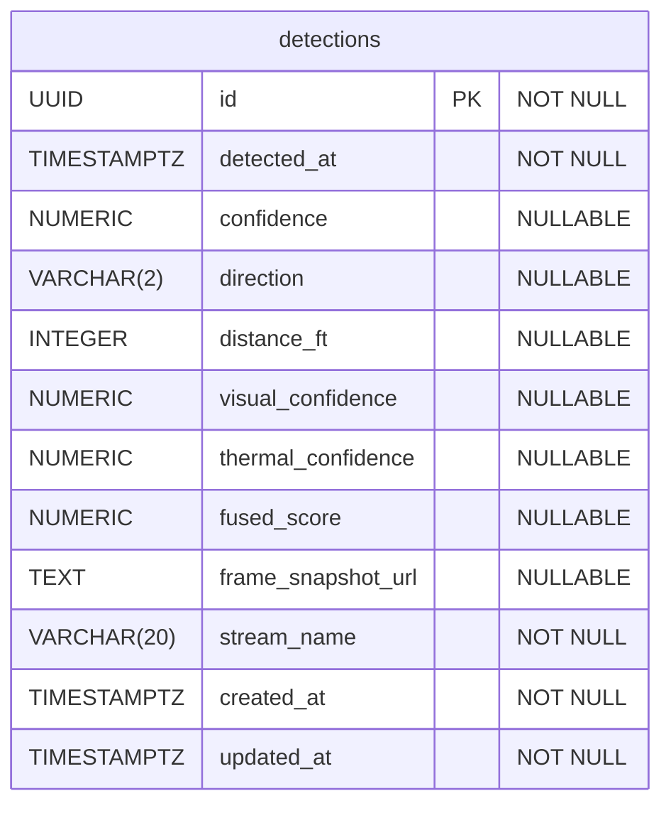

# Multimodal Drone Detection Database Schema

## Entity Relationship Diagram

## Table Details

### detections

Stores drone detection events with multimodal sensor data.

**Columns:**
- `id` (UUID, PK): Unique identifier for each detection record
- `detected_at` (TIMESTAMPTZ, NOT NULL): When the detection occurred
- `confidence` (NUMERIC(4,3)): Overall detection confidence score (0.000-1.000)
- `direction` (VARCHAR(2)): Compass direction of detection (e.g., NE, SW)
- `distance_ft` (INTEGER): Distance to detected object in feet
- `visual_confidence` (NUMERIC(4,3)): Confidence from visual camera model (0.000-1.000)
- `thermal_confidence` (NUMERIC(4,3)): Confidence from thermal camera model (0.000-1.000)
- `fused_score` (NUMERIC(4,3)): Fused/combined confidence score (0.000-1.000)
- `frame_snapshot_url` (TEXT): URL to stored frame snapshot
- `stream_name` (VARCHAR(20)): Identifier for the video stream (default: 'drone')
- `created_at` (TIMESTAMPTZ): Record creation timestamp
- `updated_at` (TIMESTAMPTZ): Last update timestamp (auto-updated via trigger)

**Indexes:**
- `idx_detections_timestamp`: Descending index on timestamp for efficient time-based queries
- `idx_detections_confidence`: Descending index on confidence for filtering high-confidence detections

**Triggers:**
- `update_detections_updated_at`: Automatically updates `updated_at` column on record modification
