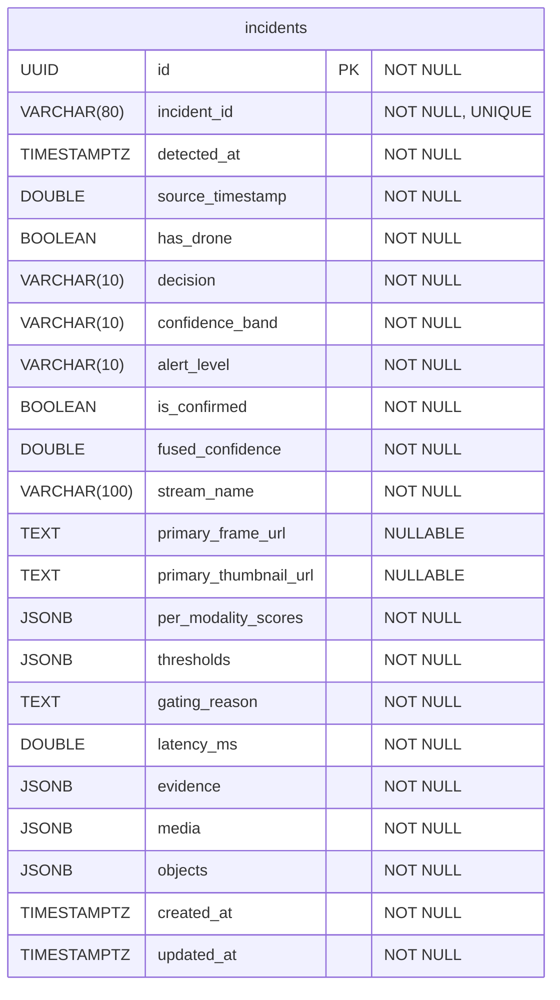

# Multimodal Drone Detection Database Schema

## Entity Relationship Diagram

```mermaid
erDiagram
    incidents {
        UUID id PK "NOT NULL"
        VARCHAR(80) incident_id "NOT NULL, UNIQUE"
        TIMESTAMPTZ detected_at "NOT NULL"
        DOUBLE source_timestamp "NOT NULL"
        BOOLEAN has_drone "NOT NULL"
        VARCHAR(10) decision "NOT NULL"
        VARCHAR(10) confidence_band "NOT NULL"
        VARCHAR(10) alert_level "NOT NULL"
        BOOLEAN is_confirmed "NOT NULL"
        DOUBLE fused_confidence "NOT NULL"
        VARCHAR(100) stream_name "NOT NULL"
        TEXT primary_frame_url "NULLABLE"
        TEXT primary_thumbnail_url "NULLABLE"
        JSONB per_modality_scores "NOT NULL"
        JSONB thresholds "NOT NULL"
        TEXT gating_reason "NOT NULL"
        DOUBLE latency_ms "NOT NULL"
        JSONB evidence "NOT NULL"
        JSONB media "NOT NULL"
        JSONB objects "NOT NULL"
        TIMESTAMPTZ created_at "NOT NULL"
        TIMESTAMPTZ updated_at "NOT NULL"
    }

```

## Table Details

### incidents

Stores fused incident events from multimodal inference.

**Columns:**
- `id` (UUID, PK): Unique identifier for each incident row
- `incident_id` (VARCHAR(80), UNIQUE): Stable external incident identifier
- `detected_at` (TIMESTAMPTZ, NOT NULL): When the incident occurred
- `source_timestamp` (DOUBLE PRECISION, NOT NULL): Source Unix timestamp from ingest payload
- `has_drone` (BOOLEAN, NOT NULL): Whether source payload indicates drone presence
- `decision` (VARCHAR(10), NOT NULL): Final decision (`drone` or `none`)
- `confidence_band` (VARCHAR(10), NOT NULL): Confidence tier (`low`, `medium`, `high`)
- `alert_level` (VARCHAR(10), NOT NULL): Derived alert level
- `is_confirmed` (BOOLEAN, NOT NULL): True if decision is confirmed for alerting
- `fused_confidence` (DOUBLE PRECISION, NOT NULL): Combined confidence score (0.000-1.000)
- `stream_name` (VARCHAR(100), NOT NULL): Source stream group name
- `primary_frame_url` (TEXT): Preferred frame URI for display
- `primary_thumbnail_url` (TEXT): Preferred thumbnail URI for display
- `per_modality_scores` (JSONB, NOT NULL): Per-modality confidence scores
- `thresholds` (JSONB, NOT NULL): Threshold values used by fusion logic
- `gating_reason` (TEXT, NOT NULL): Explanation of fusion decision path
- `latency_ms` (DOUBLE PRECISION, NOT NULL): Fusion latency in milliseconds
- `evidence` (JSONB, NOT NULL): Structured modality evidence payload
- `media` (JSONB, NOT NULL): Raw media references by modality
- `objects` (JSONB, NOT NULL): Object-level confidence list
- `created_at` (TIMESTAMPTZ): Record creation timestamp
- `updated_at` (TIMESTAMPTZ): Last update timestamp (auto-updated via trigger)

**Indexes:**
- `idx_incidents_incident_id`: Index for stable id lookup
- `idx_incidents_detected_at`: Descending index for recent incident queries
- `idx_incidents_decision`: Index for decision filter queries
- `idx_incidents_stream_name`: Index for stream-scoped queries

**Triggers:**
- `update_incidents_updated_at`: Automatically updates `updated_at` column on record modification
